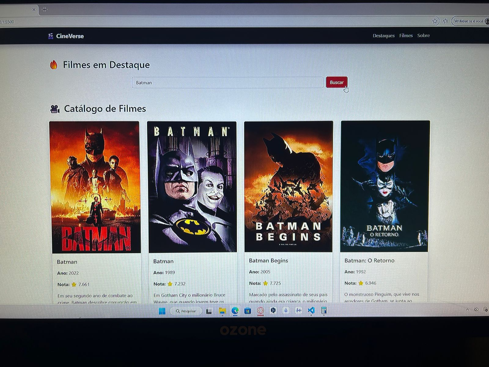
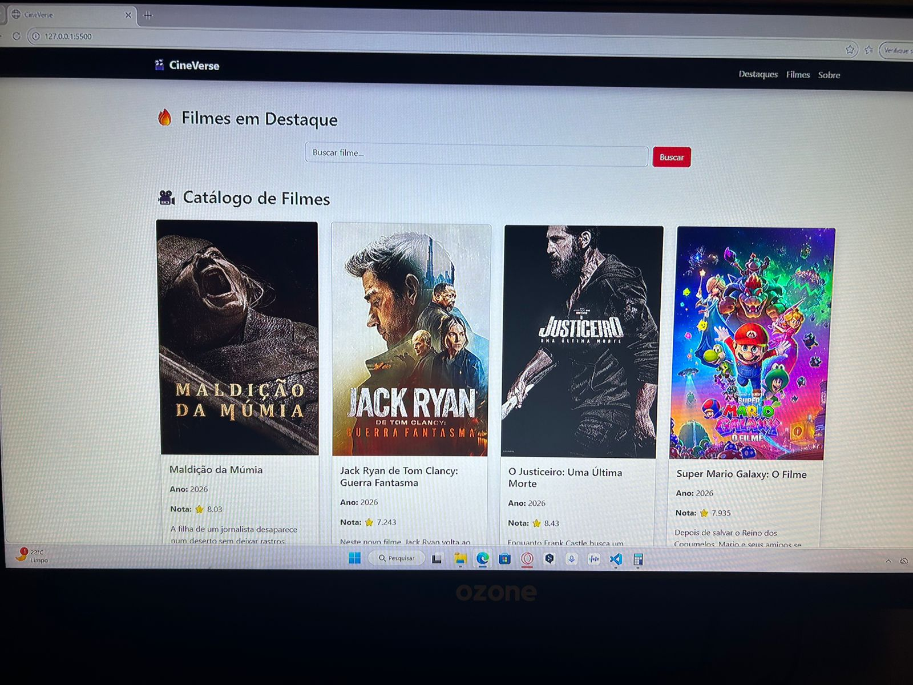

# Trabalho Prático - Semana 12

Nessa etapa, vamos evoluir o trabalho anterior, acrescentando a página de detalhes, conforme o  projeto escolhido. Imagine que a página principal (home-page) mostre um visão dos vários itens que existem no seu site. Ao clicar em um item, você é direcionado pra a página de detalhes. A página de detalhe vai mostrar todas as informações sobre o item do seu projeto. seja esse item uma notícia, filme, receita, lugar turístico ou evento.

Vamos dar um exemplo, se você escolheu o Portal de notícias locais, então sua página principal (home-page) mostra todas as notícias. Ao clicar no titulo ou na imagem de uma notícia específica, você é direcionado para a página de detalhes que trará o texto completo da notícia, o autor e outros detalhes adicionais sobre aquela notícia. O mesmo vai acontecer para todos os demais tipos de projetos. 

IMPORTANTE: Assim como informado anteriormente, capriche na etapa pois você vai precisar dessa parte para as próximas semanas. 

## Informações Gerais

- Nome: Daniell Oliveira 
- Matricula: 917809

Filmes mais recentes

O fluxo começa com a requisição, onde o JavaScript busca dados externos de uma API (ou fonte local) de forma assíncrona. Em seguida, ocorre o tratamento, etapa na qual os dados brutos são validados, filtrados ou moldados para evitar erros no sistema. Por fim, a renderização insere essas informações estruturadas no HTML, atualizando a interface para o usuário de forma dinâmica.

## Prints do trabalho

<<  COLOQUE A IMAGEM - TELA DE CARDS DE PRODUTOS - AQUI >>

## Prints do trabalho

### Catálogo de Filmes (Pesquisa Batman)

### Filmes em Destaque e Populares

<<  COLOQUE A IMAGEM - TELA DE DETALHE DO PRODUTO - AQUI >>

<<  COLOQUE A IMAGEM - TELA DO CONSOLE - AQUI >>

